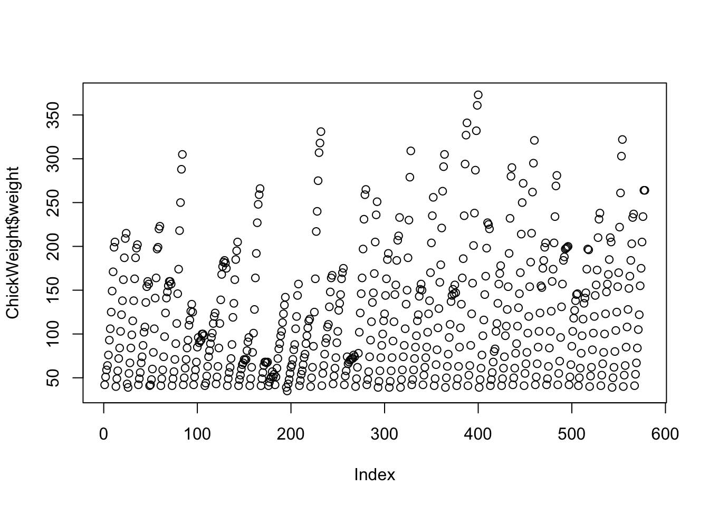
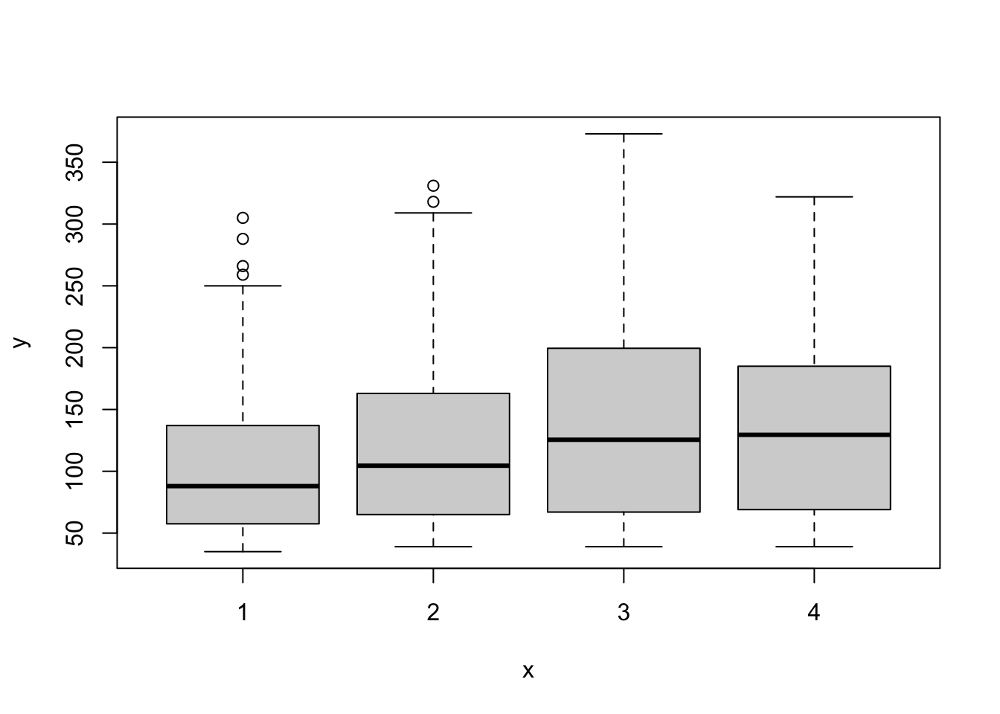
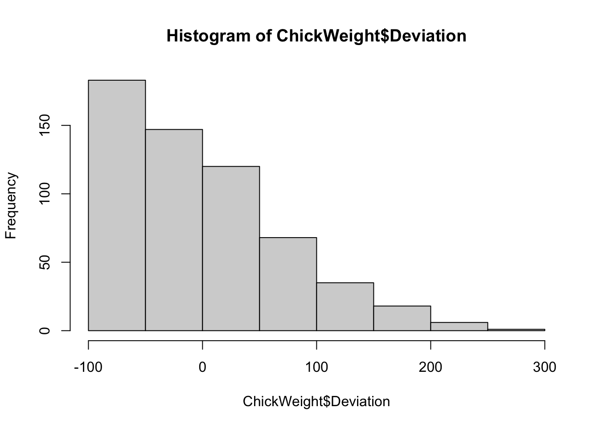

# Hello RLadies

All chapters of **RLadies** are condensed under RLadies Global and each chapter will try to showcase the topic by as many RLadies chapters as possible without redundancy. 

## StaRt here

This section is about starting in RStudio using R. This starter code is from **RLadies Freiburg** repo. Starting out with using base R which entails the use of the `$` dollar sign, which is used to grab a specific column from a dataset.

The dataset you will use is from a library called *datasets* which is a R package that contains various datasets to be used for your learning needs. Using either a simple .R file or Rmd file with a `{r}` code chunk, enter the code below for basic descriptive statistics.


```r
#--- step one is to install the library package
# install.packages('datasets')    # comment out to run
library(datasets)                 # load library

# the specific dataset we want is called ChickWeight
data("ChickWeight")               # function to pull out specific dataset

head(ChickWeight)                 # see first 6 rows of dataset
#>   weight Time Chick Diet
#> 1     42    0     1    1
#> 2     51    2     1    1
#> 3     59    4     1    1
#> 4     64    6     1    1
#> 5     76    8     1    1
#> 6     93   10     1    1
```


## Descriptive Stats

For simple descriptive statistics in R is by using the base R functions like `mean()`, `std()` and `max()`, among others. For this ChickWeight dataset, we want to find the mean weight.


```r
# find the mean weight. 
# need to use the $ to pull the data from column 'weight'

# - method 1:
# use the function mean with our dataset$column
mean(ChickWeight$weight)  
#> [1] 121.8183

# - method 2:
# make a variable to store our column data
chik_wt = ChickWeight$weight

avg_chick_wt = mean(chik_wt) # save the mean chick weight as variable
avg_chick_wt
#> [1] 121.8183
```

Now we want to create a new variable for our deviation from the mean weight.


```r
# create new column.
# dataset$NEW_COLUMN_NAME 

ChickWeight$Deviation =  ChickWeight$weight - avg_chick_wt
ChickWeight$Deviation[1:10]
#>  [1] -79.818339 -70.818339 -62.818339 -57.818339 -45.818339
#>  [6] -28.818339 -15.818339   3.181661  27.181661  49.181661
```

## For Loop

We can create a for loop to make our ChickWeight data into 2 categories by using a `ifelse` statement to make categories: 'Normal' and 'Large'.


```r
#  for loop to make categories Normal and Large based on weight
for (x in 1:nrow(ChickWeight)) {
  ChickWeight$Large = ifelse(ChickWeight$Deviation < 100, "Normal", "Large")
}
```

## Data Visual

We can use the base R plotting function `plot()` to plot our data.


```r
plot(ChickWeight$weight)
```




```r
plot(ChickWeight$Diet, ChickWeight$weight)
```




```r
# histogram
hist(ChickWeight$Deviation)
```




