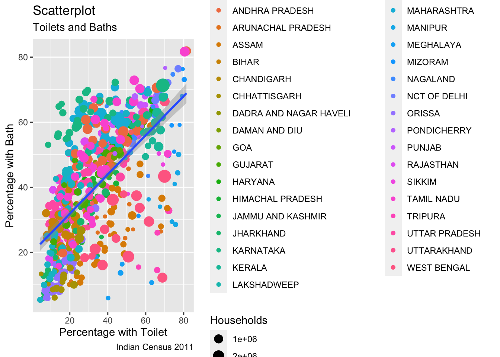

# Tidyverse 

The tidyverse has its own book called *R for Data Science* by Hadley Wickham & Garrett Grolemund (available online). This section will discuss a few functions out of the library that are very useful to know.

## Tidy Data

Data Transformation and Introduction to **Tidyverse** library. This section is by **RLadies Freiburg** Divya Seernani. 
Tidy data is data that has data or values for each column (variable) and each row (observation). The paradigm: 
`import` -> `tidy` -> [Transform <-> Visualize <-> Model] -> Communicate

### dplyr library

Inside the **tidyverse** library is the dplyr library which is helpful when creating new variables, renaming or reordering observations, selecting specific observations and calculating summary statistics among many other functions.


The dataset for this section will be the Indian Census (2011), dataset is available [here](https://github.com/nishusharma1608/India-Census-2011-Analysis/blob/master/india-districts-census-2011.csv). *Remember to click on 'raw' data format first to load in data, you should see white background and black text CSV data, copy the url link in order to read in the data*. 


The tidyverse library brings along other libraries and when you load tidyverse you will a bunch of warnings in the console, these are no concern to you, basically telling you that one library hides another for function use. To turn off warnings in your Rmd file, inside the code chunk {r} set warning to false `{r, warning= FALSE, message= FALSE}`. 


```r
# step 1 - install tidyverse library
# install.packages('tidyverse')  # comment-out to run 
library(tidyverse)

# read in the data
india_census = read.csv('https://raw.githubusercontent.com/nishusharma1608/India-Census-2011-Analysis/master/india-districts-census-2011.csv')
```


We now want to **filter** data only from Maharashtra and Gajarat, we will call the variable `WestStates`.


```r
WestStates = filter(india_census, state.name == 'Maharashtra' | State.name =='Gajarat') 
```

**Arrange** the west states in descending order (highest to lowest) by agricultural workers.


```r
AgriDist<- arrange(WestStates, Agricultural_Workers)
AgriDistDes<- arrange(WestStates, desc(Agricultural_Workers))
```


Using the **mutate** function to calculate the percentage of computers & internet per households.

```r
india_census = mutate(india_census,
                      Percent_Internet = Households_with_Internet / Households * 100,
                      Percent_Computer = Households_with_Computer / Households * 100
                      )
```


Now that we have the percent of homes with internet, let us **select** the data on households with latrines and bathing facilities.

```r
ModernHomes = select(india_census,
                     State.name, District.name, Households, Having_bathing_facility_Total_Households,
                  Having_latrine_facility_within_the_premises_Total_Households)

# and standardize the results
ModernHomes2 = mutate(ModernHomes, PercentToilet = Having_latrine_facility_within_the_premises_Total_Households / Households * 100,
                     PercentBath = Having_bathing_facility_Total_Households / Households * 100)
```


Visualize the data with the library ggplot, which comes attached (loaded) with tidyverse, but is good to load it anyway.

```r
library(ggplot2)

ModernHomesPlot <- ggplot(ModernHomes2, aes(x=PercentToilet, y=PercentBath)) + 
  geom_point(aes(col=State.name, size=Households)) + 
  geom_smooth(method="glm", se=T) + 
  labs(subtitle="Toilets and Baths", 
       y="Percentage with Bath", 
       x="Percentage with Toilet", 
       title="Scatterplot", 
       caption = "Indian Census 2011")

plot(ModernHomesPlot)
#> `geom_smooth()` using formula 'y ~ x'
```



Summary of literacy for all our data by state


```r
summarise(india_census, Percent_Literate = mean(Literate/Population*100) )
#>   Percent_Literate
#> 1          62.4632

Literacy = group_by(india_census, State.name)

LiteracyByState = summarise(Literacy, PercentLiterate = mean(Literate/Population*100) )
```


