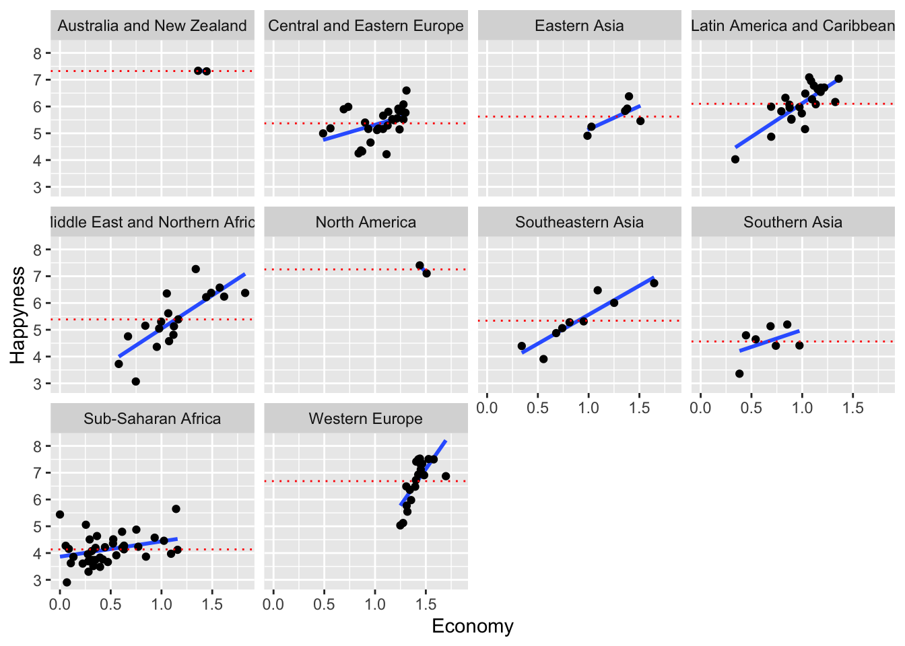
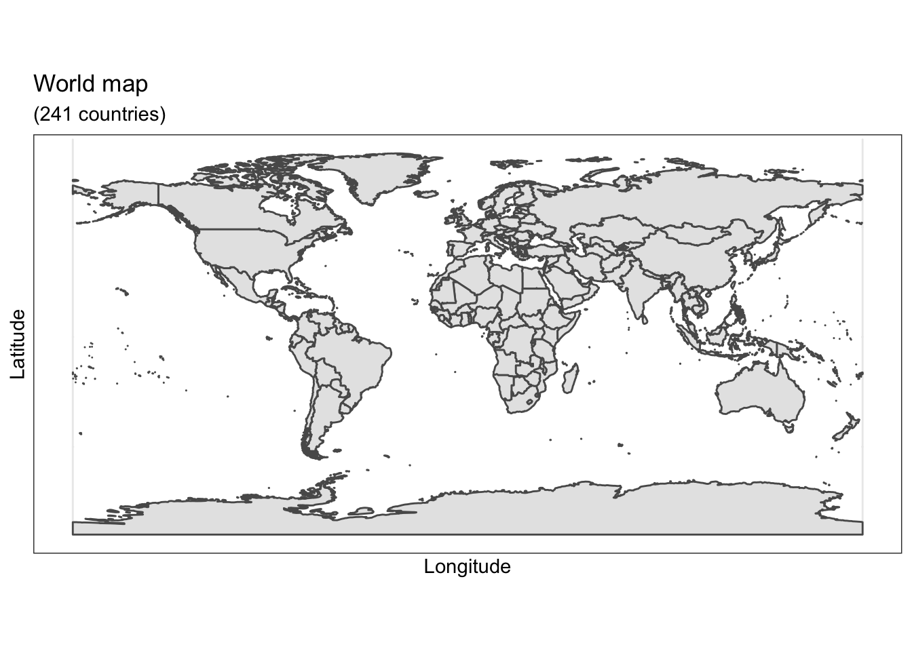

# Regression

## Linear Regression Models

Linear Regression or Linear Model (LM) using happiness data from the World Health Organization, this section is brought to you by **RLadies Freiburg** Divya and Elisa. The happiness data can be found [here](https://raw.githubusercontent.com/rladies/meetup-presentations_freiburg/master/2019-10-Modelling%201%20-%20LM%2C%20LMM%20and%20plots/Happiness_2016.csv). 


|Country     |Region         | Happiness.Rank| Happiness.Score| Lower.Confidence.Interval| Upper.Confidence.Interval| Economy..GDP.per.Capita.|  Family| Health..Life.Expectancy.| Freedom| Trust..Government.Corruption.| Generosity| Dystopia.Residual|
|:-----------|:--------------|--------------:|---------------:|-------------------------:|-------------------------:|------------------------:|-------:|------------------------:|-------:|-----------------------------:|----------:|-----------------:|
|Denmark     |Western Europe |              1|           7.526|                     7.460|                     7.592|                  1.44178| 1.16374|                  0.79504| 0.57941|                       0.44453|    0.36171|           2.73939|
|Switzerland |Western Europe |              2|           7.509|                     7.428|                     7.590|                  1.52733| 1.14524|                  0.86303| 0.58557|                       0.41203|    0.28083|           2.69463|
|Iceland     |Western Europe |              3|           7.501|                     7.333|                     7.669|                  1.42666| 1.18326|                  0.86733| 0.56624|                       0.14975|    0.47678|           2.83137|
|Norway      |Western Europe |              4|           7.498|                     7.421|                     7.575|                  1.57744| 1.12690|                  0.79579| 0.59609|                       0.35776|    0.37895|           2.66465|
|Finland     |Western Europe |              5|           7.413|                     7.351|                     7.475|                  1.40598| 1.13464|                  0.81091| 0.57104|                       0.41004|    0.25492|           2.82596|
|Canada      |North America  |              6|           7.404|                     7.335|                     7.473|                  1.44015| 1.09610|                  0.82760| 0.57370|                       0.31329|    0.44834|           2.70485|


The question is, *what parameters are there? What questions can we address using these factors.?* *Does trust in government a variable?* 


```r
plot(happiness_2016$Happiness.Score, happiness_2016$Trust..Government.Corruption.)
```


### try some models

There are 3 questions we could ask:
- Does Corruption within the government predict happiness of its citizens?
- How can we add Freedom as a predictor to the model?
- What is the difference between adding factors and looking at their interactions?


```r
## ANSWERS
#fit our regression model
RegressionModel <- lm(Happiness.Score ~ Trust..Government.Corruption., # regression formula
              data=happiness_2016) # data set

# Summarize and print the results
summary(RegressionModel) # show regression coefficients table
#> 
#> Call:
#> lm(formula = Happiness.Score ~ Trust..Government.Corruption., 
#>     data = happiness_2016)
#> 
#> Residuals:
#>     Min      1Q  Median      3Q     Max 
#> -3.3867 -0.7337  0.0653  0.8163  2.0929 
#> 
#> Coefficients:
#>                               Estimate Std. Error t value
#> (Intercept)                     4.8133     0.1335  36.042
#> Trust..Government.Corruption.   4.1336     0.7562   5.466
#>                               Pr(>|t|)    
#> (Intercept)                    < 2e-16 ***
#> Trust..Government.Corruption.  1.8e-07 ***
#> ---
#> Signif. codes:  
#> 0 '***' 0.001 '**' 0.01 '*' 0.05 '.' 0.1 ' ' 1
#> 
#> Residual standard error: 1.049 on 155 degrees of freedom
#> Multiple R-squared:  0.1616,	Adjusted R-squared:  0.1562 
#> F-statistic: 29.88 on 1 and 155 DF,  p-value: 1.798e-07


RegressionModel2 <- lm(Happiness.Score ~ Trust..Government.Corruption. + Freedom,
                      data=happiness_2016) 
summary(RegressionModel2) 
#> 
#> Call:
#> lm(formula = Happiness.Score ~ Trust..Government.Corruption. + 
#>     Freedom, data = happiness_2016)
#> 
#> Residuals:
#>      Min       1Q   Median       3Q      Max 
#> -3.12005 -0.75060  0.08456  0.70370  1.99165 
#> 
#> Coefficients:
#>                               Estimate Std. Error t value
#> (Intercept)                     3.7395     0.2047  18.270
#> Trust..Government.Corruption.   1.6146     0.7785   2.074
#> Freedom                         3.8288     0.5940   6.445
#>                               Pr(>|t|)    
#> (Intercept)                    < 2e-16 ***
#> Trust..Government.Corruption.   0.0397 *  
#> Freedom                       1.41e-09 ***
#> ---
#> Signif. codes:  
#> 0 '***' 0.001 '**' 0.01 '*' 0.05 '.' 0.1 ' ' 1
#> 
#> Residual standard error: 0.9337 on 154 degrees of freedom
#> Multiple R-squared:  0.3397,	Adjusted R-squared:  0.3312 
#> F-statistic: 39.62 on 2 and 154 DF,  p-value: 1.313e-14


RegressionModel3 <- lm(Happiness.Score ~ Trust..Government.Corruption. * Freedom, 
                       data=happiness_2016) 

summary(RegressionModel3)
#> 
#> Call:
#> lm(formula = Happiness.Score ~ Trust..Government.Corruption. * 
#>     Freedom, data = happiness_2016)
#> 
#> Residuals:
#>     Min      1Q  Median      3Q     Max 
#> -3.4328 -0.6808  0.1590  0.6513  2.0290 
#> 
#> Coefficients:
#>                                       Estimate Std. Error
#> (Intercept)                             4.6015     0.3507
#> Trust..Government.Corruption.          -7.0035     2.9817
#> Freedom                                 1.8776     0.8728
#> Trust..Government.Corruption.:Freedom  17.7259     5.9306
#>                                       t value Pr(>|t|)    
#> (Intercept)                            13.119  < 2e-16 ***
#> Trust..Government.Corruption.          -2.349  0.02011 *  
#> Freedom                                 2.151  0.03303 *  
#> Trust..Government.Corruption.:Freedom   2.989  0.00326 ** 
#> ---
#> Signif. codes:  
#> 0 '***' 0.001 '**' 0.01 '*' 0.05 '.' 0.1 ' ' 1
#> 
#> Residual standard error: 0.9105 on 153 degrees of freedom
#> Multiple R-squared:  0.3762,	Adjusted R-squared:  0.3639 
#> F-statistic: 30.75 on 3 and 153 DF,  p-value: 1.293e-15
```

There are a number of different Parametric and non-parametric tests we can try in the same format. Instead of lm, we could use t.test(), aov(), wilcox.test(), kruskal.test().

Is there a categorical variable we can use to run an ANOVA on?


*How does the happiness quotient differ based on regions?*


```r
ANOVA <- aov(Happiness.Score ~ Region, 
             data=happiness_2016) 
summary(ANOVA) 
#>              Df Sum Sq Mean Sq F value Pr(>F)    
#> Region        9 126.69  14.077      27 <2e-16 ***
#> Residuals   147  76.64   0.521                   
#> ---
#> Signif. codes:  
#> 0 '***' 0.001 '**' 0.01 '*' 0.05 '.' 0.1 ' ' 1
TukeyHSD(ANOVA)
#>   Tukey multiple comparisons of means
#>     95% family-wise confidence level
#> 
#> Fit: aov(formula = Happiness.Score ~ Region, data = happiness_2016)
#> 
#> $Region
#>                                                                    diff
#> Central and Eastern Europe-Australia and New Zealand        -1.95281034
#> Eastern Asia-Australia and New Zealand                      -1.69933333
#> Latin America and Caribbean-Australia and New Zealand       -1.22175000
#> Middle East and Northern Africa-Australia and New Zealand   -1.93744737
#> North America-Australia and New Zealand                     -0.06950000
#> Southeastern Asia-Australia and New Zealand                 -1.98461111
#> Southern Asia-Australia and New Zealand                     -2.76021429
#> Sub-Saharan Africa-Australia and New Zealand                -3.18707895
#> Western Europe-Australia and New Zealand                    -0.63783333
#> Eastern Asia-Central and Eastern Europe                      0.25347701
#> Latin America and Caribbean-Central and Eastern Europe       0.73106034
#> Middle East and Northern Africa-Central and Eastern Europe   0.01536298
#> North America-Central and Eastern Europe                     1.88331034
#> Southeastern Asia-Central and Eastern Europe                -0.03180077
#> Southern Asia-Central and Eastern Europe                    -0.80740394
#> Sub-Saharan Africa-Central and Eastern Europe               -1.23426860
#> Western Europe-Central and Eastern Europe                    1.31497701
#> Latin America and Caribbean-Eastern Asia                     0.47758333
#> Middle East and Northern Africa-Eastern Asia                -0.23811404
#> North America-Eastern Asia                                   1.62983333
#> Southeastern Asia-Eastern Asia                              -0.28527778
#> Southern Asia-Eastern Asia                                  -1.06088095
#> Sub-Saharan Africa-Eastern Asia                             -1.48774561
#> Western Europe-Eastern Asia                                  1.06150000
#> Middle East and Northern Africa-Latin America and Caribbean -0.71569737
#> North America-Latin America and Caribbean                    1.15225000
#> Southeastern Asia-Latin America and Caribbean               -0.76286111
#> Southern Asia-Latin America and Caribbean                   -1.53846429
#> Sub-Saharan Africa-Latin America and Caribbean              -1.96532895
#> Western Europe-Latin America and Caribbean                   0.58391667
#> North America-Middle East and Northern Africa                1.86794737
#> Southeastern Asia-Middle East and Northern Africa           -0.04716374
#> Southern Asia-Middle East and Northern Africa               -0.82276692
#> Sub-Saharan Africa-Middle East and Northern Africa          -1.24963158
#> Western Europe-Middle East and Northern Africa               1.29961404
#> Southeastern Asia-North America                             -1.91511111
#> Southern Asia-North America                                 -2.69071429
#> Sub-Saharan Africa-North America                            -3.11757895
#> Western Europe-North America                                -0.56833333
#> Southern Asia-Southeastern Asia                             -0.77560317
#> Sub-Saharan Africa-Southeastern Asia                        -1.20246784
#> Western Europe-Southeastern Asia                             1.34677778
#> Sub-Saharan Africa-Southern Asia                            -0.42686466
#> Western Europe-Southern Asia                                 2.12238095
#> Western Europe-Sub-Saharan Africa                            2.54924561
#>                                                                     lwr
#> Central and Eastern Europe-Australia and New Zealand        -3.64886668
#> Eastern Asia-Australia and New Zealand                      -3.59354189
#> Latin America and Caribbean-Australia and New Zealand       -2.92916652
#> Middle East and Northern Africa-Australia and New Zealand   -3.66205885
#> North America-Australia and New Zealand                     -2.38942221
#> Southeastern Asia-Australia and New Zealand                 -3.79817773
#> Southern Asia-Australia and New Zealand                     -4.62029016
#> Sub-Saharan Africa-Australia and New Zealand                -4.87012741
#> Western Europe-Australia and New Zealand                    -2.35460563
#> Eastern Asia-Central and Eastern Europe                     -0.78700079
#> Latin America and Caribbean-Central and Eastern Europe       0.09087351
#> Middle East and Northern Africa-Central and Eastern Europe  -0.66936527
#> North America-Central and Eastern Europe                     0.18725401
#> Southeastern Asia-Central and Eastern Europe                -0.91700803
#> Southern Asia-Central and Eastern Europe                    -1.78436365
#> Sub-Saharan Africa-Central and Eastern Europe               -1.80630021
#> Western Europe-Central and Eastern Europe                    0.65024012
#> Latin America and Caribbean-Eastern Asia                    -0.58131144
#> Middle East and Northern Africa-Eastern Asia                -1.32451715
#> North America-Eastern Asia                                  -0.26437522
#> Southeastern Asia-Eastern Asia                              -1.50798414
#> Southern Asia-Eastern Asia                                  -2.35156652
#> Sub-Saharan Africa-Eastern Asia                             -2.50688207
#> Western Europe-Eastern Asia                                 -0.01241531
#> Middle East and Northern Africa-Latin America and Caribbean -1.42809953
#> North America-Latin America and Caribbean                   -0.55516652
#> Southeastern Asia-Latin America and Caribbean               -1.66964442
#> Southern Asia-Latin America and Caribbean                   -2.53501551
#> Sub-Saharan Africa-Latin America and Caribbean              -2.57021260
#> Western Europe-Latin America and Caribbean                  -0.10929268
#> North America-Middle East and Northern Africa                0.14333589
#> Southeastern Asia-Middle East and Northern Africa           -0.98592333
#> Southern Asia-Middle East and Northern Africa               -1.84849980
#> Sub-Saharan Africa-Middle East and Northern Africa          -1.90147345
#> Western Europe-Middle East and Northern Africa               0.56507146
#> Southeastern Asia-North America                             -3.72867773
#> Southern Asia-North America                                 -4.55079016
#> Sub-Saharan Africa-North America                            -4.80062741
#> Western Europe-North America                                -2.28510563
#> Southern Asia-Southeastern Asia                             -1.94473408
#> Sub-Saharan Africa-Southeastern Asia                        -2.06248932
#> Western Europe-Southeastern Asia                             0.42249865
#> Sub-Saharan Africa-Southern Asia                            -1.38106345
#> Western Europe-Southern Asia                                 1.10988389
#> Western Europe-Sub-Saharan Africa                            1.91843647
#>                                                                      upr
#> Central and Eastern Europe-Australia and New Zealand        -0.256754011
#> Eastern Asia-Australia and New Zealand                       0.194875220
#> Latin America and Caribbean-Australia and New Zealand        0.485666516
#> Middle East and Northern Africa-Australia and New Zealand   -0.212835891
#> North America-Australia and New Zealand                      2.250422211
#> Southeastern Asia-Australia and New Zealand                 -0.171044494
#> Southern Asia-Australia and New Zealand                     -0.900138412
#> Sub-Saharan Africa-Australia and New Zealand                -1.504030481
#> Western Europe-Australia and New Zealand                     1.078938960
#> Eastern Asia-Central and Eastern Europe                      1.293954817
#> Latin America and Caribbean-Central and Eastern Europe       1.371247178
#> Middle East and Northern Africa-Central and Eastern Europe   0.700091220
#> North America-Central and Eastern Europe                     3.579366678
#> Southeastern Asia-Central and Eastern Europe                 0.853406494
#> Southern Asia-Central and Eastern Europe                     0.169555770
#> Sub-Saharan Africa-Central and Eastern Europe               -0.662236994
#> Western Europe-Central and Eastern Europe                    1.979713898
#> Latin America and Caribbean-Eastern Asia                     1.536478105
#> Middle East and Northern Africa-Eastern Asia                 0.848289078
#> North America-Eastern Asia                                   3.524041887
#> Southeastern Asia-Eastern Asia                               0.937428586
#> Southern Asia-Eastern Asia                                   0.229804615
#> Sub-Saharan Africa-Eastern Asia                             -0.468609157
#> Western Europe-Eastern Asia                                  2.135415306
#> Middle East and Northern Africa-Latin America and Caribbean -0.003295206
#> North America-Latin America and Caribbean                    2.859666516
#> Southeastern Asia-Latin America and Caribbean                0.143922197
#> Southern Asia-Latin America and Caribbean                   -0.541913057
#> Sub-Saharan Africa-Latin America and Caribbean              -1.360445294
#> Western Europe-Latin America and Caribbean                   1.277126016
#> North America-Middle East and Northern Africa                3.592558845
#> Southeastern Asia-Middle East and Northern Africa            0.891595840
#> Southern Asia-Middle East and Northern Africa                0.202965961
#> Sub-Saharan Africa-Middle East and Northern Africa          -0.597789711
#> Western Europe-Middle East and Northern Africa               2.034156606
#> Southeastern Asia-North America                             -0.101544494
#> Southern Asia-North America                                 -0.830638412
#> Sub-Saharan Africa-North America                            -1.434530481
#> Western Europe-North America                                 1.148438960
#> Southern Asia-Southeastern Asia                              0.393527727
#> Sub-Saharan Africa-Southeastern Asia                        -0.342446355
#> Western Europe-Southeastern Asia                             2.271056910
#> Sub-Saharan Africa-Southern Asia                             0.527334128
#> Western Europe-Southern Asia                                 3.134878013
#> Western Europe-Sub-Saharan Africa                            3.180054762
#>                                                                 p adj
#> Central and Eastern Europe-Australia and New Zealand        0.0110279
#> Eastern Asia-Australia and New Zealand                      0.1200475
#> Latin America and Caribbean-Australia and New Zealand       0.3959950
#> Middle East and Northern Africa-Australia and New Zealand   0.0148505
#> North America-Australia and New Zealand                     1.0000000
#> Southeastern Asia-Australia and New Zealand                 0.0200680
#> Southern Asia-Australia and New Zealand                     0.0001878
#> Sub-Saharan Africa-Australia and New Zealand                0.0000004
#> Western Europe-Australia and New Zealand                    0.9722986
#> Eastern Asia-Central and Eastern Europe                     0.9987321
#> Latin America and Caribbean-Central and Eastern Europe      0.0122030
#> Middle East and Northern Africa-Central and Eastern Europe  1.0000000
#> North America-Central and Eastern Europe                    0.0170083
#> Southeastern Asia-Central and Eastern Europe                1.0000000
#> Southern Asia-Central and Eastern Europe                    0.2021961
#> Sub-Saharan Africa-Central and Eastern Europe               0.0000000
#> Western Europe-Central and Eastern Europe                   0.0000001
#> Latin America and Caribbean-Eastern Asia                    0.9092820
#> Middle East and Northern Africa-Eastern Asia                0.9994553
#> North America-Eastern Asia                                  0.1587204
#> Southeastern Asia-Eastern Asia                              0.9990999
#> Southern Asia-Eastern Asia                                  0.2085183
#> Sub-Saharan Africa-Eastern Asia                             0.0002599
#> Western Europe-Eastern Asia                                 0.0555311
#> Middle East and Northern Africa-Latin America and Caribbean 0.0479233
#> North America-Latin America and Caribbean                   0.4832340
#> Southeastern Asia-Latin America and Caribbean               0.1822793
#> Southern Asia-Latin America and Caribbean                   0.0000824
#> Sub-Saharan Africa-Latin America and Caribbean              0.0000000
#> Western Europe-Latin America and Caribbean                  0.1809182
#> North America-Middle East and Northern Africa               0.0224810
#> Southeastern Asia-Middle East and Northern Africa           1.0000000
#> Southern Asia-Middle East and Northern Africa               0.2380242
#> Sub-Saharan Africa-Middle East and Northern Africa          0.0000003
#> Western Europe-Middle East and Northern Africa              0.0000030
#> Southeastern Asia-North America                             0.0294290
#> Southern Asia-North America                                 0.0003101
#> Sub-Saharan Africa-North America                            0.0000008
#> Western Europe-North America                                0.9873720
#> Southern Asia-Southeastern Asia                             0.5086390
#> Sub-Saharan Africa-Southeastern Asia                        0.0005847
#> Western Europe-Southeastern Asia                            0.0002694
#> Sub-Saharan Africa-Southern Asia                            0.9133646
#> Western Europe-Southern Asia                                0.0000000
#> Western Europe-Sub-Saharan Africa                           0.0000000
```


### independence of the data

Let's think about the data and pose some questions. 


A) Do you think that countries in the same region tend to be more similar to each other? 
If your answer is yes, then the countries are not really independent and identically distributed data. This could be a problem with statistical models. So you have three options:

- 1. Ignore the problem, or argue why you think your data IS independent (you will no be the only one)
- 2. Do not ignore it, take the average of each region and then make a model using this average. Yes, what you think is correct, you loose a lot of data!
- 3. Do one linear model for each region...data costly (e.g. Australia and North America have only two data points)
- 4. Try a linear mixed model


B) How variable is the happiness between regions?


C) How does happiness depend on other predictors such as health, economy and generosity?


### visualization of the data

We can do some plots to see how data look like.
In this plot we visualize how economy affects happiness in every region. We could do one plot per predictor. 


```r
library(dplyr)
#> 
#> Attaching package: 'dplyr'
#> The following objects are masked from 'package:stats':
#> 
#>     filter, lag
#> The following objects are masked from 'package:base':
#> 
#>     intersect, setdiff, setequal, union
library(tidyr)
Happiness_2016 <- happiness_2016 %>% group_by(Region) %>% mutate(mean.reg = mean(Happiness.Score)) %>%  ungroup()
library(ggplot2)
ggplot(Happiness_2016) + 
  aes(x = Economy..GDP.per.Capita., y = Happiness.Score) + 
  stat_smooth(method = "lm", se = FALSE) +
  # Put the points on top of lines
  geom_point() +
  facet_wrap("Region") +
  labs(x = "Economy", y = "Happyness") +
  geom_hline(aes(yintercept = mean.reg), colour='red', lty="dotted")
#> `geom_smooth()` using formula 'y ~ x'
```




Given what we see in the data, we can try two different models: 


```r
library(lme4)
#> Loading required package: Matrix
#> 
#> Attaching package: 'Matrix'
#> The following objects are masked from 'package:tidyr':
#> 
#>     expand, pack, unpack
happy.mixed.model <-  lmer(Happiness.Score ~ Economy..GDP.per.Capita. + Health..Life.Expectancy.+ Generosity + (1|Region), data = happiness_2016)

summary(happy.mixed.model)
#> Linear mixed model fit by REML ['lmerMod']
#> Formula: 
#> Happiness.Score ~ Economy..GDP.per.Capita. + Health..Life.Expectancy. +  
#>     Generosity + (1 | Region)
#>    Data: happiness_2016
#> 
#> REML criterion at convergence: 288.4
#> 
#> Scaled residuals: 
#>     Min      1Q  Median      3Q     Max 
#> -3.7228 -0.5314  0.0542  0.6596  3.6518 
#> 
#> Random effects:
#>  Groups   Name        Variance Std.Dev.
#>  Region   (Intercept) 0.1295   0.3599  
#>  Residual             0.3302   0.5746  
#> Number of obs: 157, groups:  Region, 10
#> 
#> Fixed effects:
#>                          Estimate Std. Error t value
#> (Intercept)                3.0080     0.2890  10.407
#> Economy..GDP.per.Capita.   1.5252     0.2136   7.142
#> Health..Life.Expectancy.   1.1030     0.4661   2.367
#> Generosity                 1.2551     0.4088   3.070
#> 
#> Correlation of Fixed Effects:
#>             (Intr) E..GDP H..L.E
#> Ec..GDP..C. -0.217              
#> Hlth..Lf.E. -0.468 -0.624       
#> Generosity  -0.415  0.174 -0.118

happy.mixed.model.2 <-  lmer(Happiness.Score ~ Economy..GDP.per.Capita. + Health..Life.Expectancy.+ Generosity + (Economy..GDP.per.Capita.|Region), 
                             data = happiness_2016)

summary(happy.mixed.model)
#> Linear mixed model fit by REML ['lmerMod']
#> Formula: 
#> Happiness.Score ~ Economy..GDP.per.Capita. + Health..Life.Expectancy. +  
#>     Generosity + (1 | Region)
#>    Data: happiness_2016
#> 
#> REML criterion at convergence: 288.4
#> 
#> Scaled residuals: 
#>     Min      1Q  Median      3Q     Max 
#> -3.7228 -0.5314  0.0542  0.6596  3.6518 
#> 
#> Random effects:
#>  Groups   Name        Variance Std.Dev.
#>  Region   (Intercept) 0.1295   0.3599  
#>  Residual             0.3302   0.5746  
#> Number of obs: 157, groups:  Region, 10
#> 
#> Fixed effects:
#>                          Estimate Std. Error t value
#> (Intercept)                3.0080     0.2890  10.407
#> Economy..GDP.per.Capita.   1.5252     0.2136   7.142
#> Health..Life.Expectancy.   1.1030     0.4661   2.367
#> Generosity                 1.2551     0.4088   3.070
#> 
#> Correlation of Fixed Effects:
#>             (Intr) E..GDP H..L.E
#> Ec..GDP..C. -0.217              
#> Hlth..Lf.E. -0.468 -0.624       
#> Generosity  -0.415  0.174 -0.118
summary(happy.mixed.model.2)
#> Linear mixed model fit by REML ['lmerMod']
#> Formula: 
#> Happiness.Score ~ Economy..GDP.per.Capita. + Health..Life.Expectancy. +  
#>     Generosity + (Economy..GDP.per.Capita. | Region)
#>    Data: happiness_2016
#> 
#> REML criterion at convergence: 276.9
#> 
#> Scaled residuals: 
#>     Min      1Q  Median      3Q     Max 
#> -3.7297 -0.5007  0.0021  0.6491  3.1793 
#> 
#> Random effects:
#>  Groups   Name                     Variance Std.Dev. Corr 
#>  Region   (Intercept)              0.09681  0.3111        
#>           Economy..GDP.per.Capita. 0.42078  0.6487   -0.87
#>  Residual                          0.29387  0.5421        
#> Number of obs: 157, groups:  Region, 10
#> 
#> Fixed effects:
#>                          Estimate Std. Error t value
#> (Intercept)                2.9115     0.2270  12.824
#> Economy..GDP.per.Capita.   1.8639     0.3101   6.010
#> Health..Life.Expectancy.   0.6234     0.4415   1.412
#> Generosity                 1.0923     0.3895   2.805
#> 
#> Correlation of Fixed Effects:
#>             (Intr) E..GDP H..L.E
#> Ec..GDP..C. -0.390              
#> Hlth..Lf.E. -0.323 -0.559       
#> Generosity  -0.440  0.049 -0.092
```

We do not have p-values here hummm!


```r
library(lmerTest)
#> 
#> Attaching package: 'lmerTest'
#> The following object is masked from 'package:lme4':
#> 
#>     lmer
#> The following object is masked from 'package:stats':
#> 
#>     step
# Test significance of random effects
ranova(happy.mixed.model.2)
#> ANOVA-like table for random-effects: Single term deletions
#> 
#> Model:
#> Happiness.Score ~ Economy..GDP.per.Capita. + Health..Life.Expectancy. + Generosity + (Economy..GDP.per.Capita. | Region)
#>                                                                 npar
#> <none>                                                             8
#> Economy..GDP.per.Capita. in (Economy..GDP.per.Capita. | Region)    6
#>                                                                  logLik
#> <none>                                                          -138.45
#> Economy..GDP.per.Capita. in (Economy..GDP.per.Capita. | Region) -144.21
#>                                                                    AIC
#> <none>                                                          292.89
#> Economy..GDP.per.Capita. in (Economy..GDP.per.Capita. | Region) 300.42
#>                                                                    LRT
#> <none>                                                                
#> Economy..GDP.per.Capita. in (Economy..GDP.per.Capita. | Region) 11.529
#>                                                                 Df
#> <none>                                                            
#> Economy..GDP.per.Capita. in (Economy..GDP.per.Capita. | Region)  2
#>                                                                 Pr(>Chisq)
#> <none>                                                                    
#> Economy..GDP.per.Capita. in (Economy..GDP.per.Capita. | Region)   0.003137
#>                                                                   
#> <none>                                                            
#> Economy..GDP.per.Capita. in (Economy..GDP.per.Capita. | Region) **
#> ---
#> Signif. codes:  
#> 0 '***' 0.001 '**' 0.01 '*' 0.05 '.' 0.1 ' ' 1

#Test significance of fixed effects
ml.happy.mixed.model <- update(happy.mixed.model, REML = FALSE) # this changes the algorithm used to fit the model

#Finally we can test significance
anova(as_lmerModLmerTest(ml.happy.mixed.model))
#> Type III Analysis of Variance Table with Satterthwaite's method
#>                           Sum Sq Mean Sq NumDF  DenDF
#> Economy..GDP.per.Capita. 16.9971 16.9971     1 152.49
#> Health..Life.Expectancy.  1.9558  1.9558     1 138.78
#> Generosity                3.1992  3.1992     1 151.95
#>                          F value    Pr(>F)    
#> Economy..GDP.per.Capita. 52.3454 2.119e-11 ***
#> Health..Life.Expectancy.  6.0233  0.015356 *  
#> Generosity                9.8524  0.002038 ** 
#> ---
#> Signif. codes:  
#> 0 '***' 0.001 '**' 0.01 '*' 0.05 '.' 0.1 ' ' 1
```


### Ploting the data in a map


```r
require(rnaturalearth)
#> Loading required package: rnaturalearth
require(rnaturalearthdata)
#> Loading required package: rnaturalearthdata
world <- ne_countries(scale = "medium", returnclass = "sf") # this is another function to get polygons of countries. 
```


```r
library(ggplot2)
ggplot(data = world) +
    theme_bw()+ 
    geom_sf() + 
    xlab("Longitude") + ylab("Latitude") + 
    ggtitle("World map", subtitle = paste0("(", dim(world)[1], " countries)"))
```




```{}
#both df woth the same name of the varaible we will use to join
colnames(happiness_2016)[1] <- "name"
Happiness_GEO <- left_join(world, happiness_2016, by="name")
```
```{}
ggplot(data = Happiness_GEO) +
    geom_sf(aes(fill = Happiness.Score )) +
    scale_fill_viridis_c(option = "plasma") +  # this allows you to choose different colour scale
    ggtitle("World Happiness Studies")
```

#### Where is the model working better?

```{}
happy.predictions <- predict(happy.mixed.model)
#Expected - Observed
happy.residuasl <-  (happiness_2016$Happiness.Score - happy.predictions) # Obaserved - predicted
Happiness_2016$Model.Residuals <- happy.residuasl
Happiness_GEO <- left_join(world, Happiness_2016, by="name")
```

```{}
ggplot(data = Happiness_GEO) +
    geom_sf(aes(fill = Model.Residuals )) +
    scale_fill_viridis_c(option = "plasma") +  # this allows you to choose different colour scale
    ggtitle("World Happiness Studies")
```


